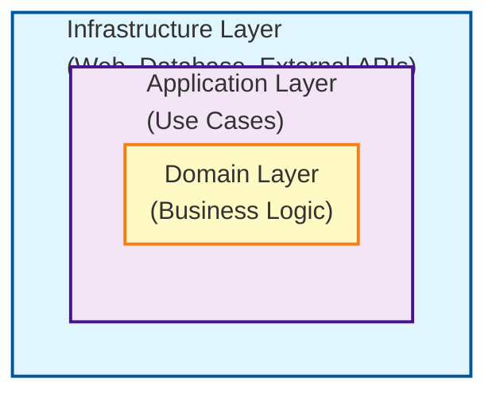
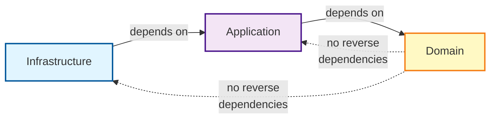

# Architecture Guide

This project follows **Clean Architecture** and **Domain-Driven Design (DDD)** principles to maintain a clean separation of concerns and prevent architectural erosion.

## Layer Structure



### Domain Layer (`domain`)

**Purpose**: Contains core business logic and domain models

**Rules**:
- **Must** only depend on itself and standard library (Kotlin/Java)
- **Must NOT** depend on infrastructure layer
- **Must NOT** depend on Spring Framework
- **Must NOT** depend on database libraries
- **Must NOT** depend on web frameworks

**Contents**:
- Domain models (entities, value objects)
- Repository interfaces (ports)
- Domain services
- Domain events

### Application Layer (`application`)

**Purpose**: Orchestrates domain logic to fulfill use cases

**Rules**:
- **Must** depend on domain layer
- **Must NOT** depend on infrastructure layer
- Uses factory functions for dependency injection

**Contents**:
- Use case implementations
- Application services
- DTOs for use case inputs/outputs

### Infrastructure Layer (`infrastructure`)

**Purpose**: Implements technical details and external integrations

**Rules**:
- **May** depend on application and domain layers
- Implements repository interfaces (adapters)
- Handles framework-specific code

**Contents**:
- Database adapters (implements repository interfaces)
- Web controllers and handlers
- External API clients
- Configuration classes

## Preventing Architecture Violations

### 1. Automated Testing with Kotest + Konsist

The project uses **Kotest** (idiomatic Kotlin testing framework) combined with **Konsist** for architecture verification.

```bash
./gradlew test
```

#### Test Structure with Kotest FunSpec

All architecture tests use **Kotest FunSpec** for consistency and simplicity.

**Basic Layer Dependency Test** ([`CleanArchitectureSpec.kt`](../src/test/kotlin/io/github/seijikohara/devtools/architecture/CleanArchitectureSpec.kt)):

```kotlin
test("domain layer should not depend on infrastructure layer") {
    Konsist
        .scopeFromProduction()
        .files
        .withPackage("..domain..")
        .assertFalse(testName = koTestName) {
            it.hasImport { import -> import.name.contains(".infrastructure.") }
        }
}
```

**Data-Driven Testing** ([`PackageDependencySpec.kt`](../src/test/kotlin/io/github/seijikohara/devtools/architecture/PackageDependencySpec.kt)):

```kotlin
context("Domain layer forbidden dependencies") {
    data class ForbiddenDependency(
        val name: String,
        val packagePrefixes: List<String>,
    )

    withData(
        nameFn = { it.name },
        ForbiddenDependency("Spring Framework", listOf("org.springframework")),
        ForbiddenDependency("R2DBC", listOf("io.r2dbc")),
        ForbiddenDependency("Infrastructure layer", listOf(".infrastructure.")),
    ) { (_, packagePrefixes) ->
        Konsist
            .scopeFromProduction()
            .files
            .withPackage("..domain..")
            .assertFalse(testName = koTestName) {
                it.hasImport { import ->
                    packagePrefixes.any { prefix ->
                        if (prefix.startsWith(".")) {
                            import.name.contains(prefix)
                        } else {
                            import.name.startsWith(prefix)
                        }
                    }
                }
            }
    }
}
```

**Naming Convention Test** ([`NamingConventionSpec.kt`](../src/test/kotlin/io/github/seijikohara/devtools/architecture/NamingConventionSpec.kt)):

```kotlin
context("Interface naming conventions") {
    test("repository interfaces should end with 'Repository' or 'Resolver'") {
        Konsist
            .scopeFromProduction()
            .interfaces()
            .withPackage("..domain..repository..")
            .assertTrue(testName = koTestName) {
                it.name.endsWith("Repository") || it.name.endsWith("Resolver")
            }
    }
}
```

#### Benefits of Kotest + Konsist

1. **Kotlin-Native**: Konsist is designed specifically for Kotlin codebases with first-class support for Kotlin language features
2. **Multiple Test Styles**: Choose the style that fits your needs (`FunSpec`, `BehaviorSpec`, `DescribeSpec`, etc.)
3. **Data-Driven Testing**: Test multiple scenarios with `withData` for clearer violation reports
4. **Idiomatic Kotlin**: Natural Kotlin syntax with DSL
5. **Better Test Names**: Kotest generates readable test names from string descriptions
6. **Context and Hooks**: `beforeSpec`, `afterSpec`, nested contexts
7. **Simple API**: More intuitive and concise than ArchUnit for common architecture checks

These tests automatically detect violations:
- Domain layer depending on infrastructure
- Application layer depending on infrastructure
- Domain layer using Spring/database/web frameworks
- Naming convention violations

**Build will fail** if any violations are detected, preventing architectural erosion.

### 2. Dependency Direction Rule

Always follow the **Dependency Inversion Principle**:



### 3. Adapter Pattern

Use adapters to bridge domain interfaces with infrastructure:

**Good Example**:

```kotlin
// Domain layer - defines interface
interface HtmlEntityRepository {
    suspend fun searchByName(name: String, pagination: Pagination): PaginatedResult<HtmlEntity>
}

// Infrastructure layer - implements interface
class HtmlEntityRepositoryAdapter(
    private val dbRepository: HtmlEntityDbRepository
) : HtmlEntityRepository {
    // Implementation details
}
```

**Bad Example**:

```kotlin
// Domain layer directly using Spring Data
interface HtmlEntityRepository : CoroutineCrudRepository<HtmlEntity, Long> {
    // VIOLATION: Violates dependency rule!
}
```

### 4. Factory Functions for Use Cases

Application layer uses factory functions to avoid Spring annotations:

```kotlin
// Application layer
fun searchHtmlEntitiesUseCase(repository: HtmlEntityRepository): SearchHtmlEntitiesUseCase =
    SearchHtmlEntitiesUseCase { query ->
        repository.searchByName(query.name, query.pagination)
    }

// Infrastructure configuration
@Bean
fun searchHtmlEntitiesUseCase(repository: HtmlEntityRepository) =
    createSearchHtmlEntitiesUseCase(repository)
```

### 5. Expression Chains for Functional Purity

Avoid intermediate variables; use expression chains:

```kotlin
// Good - pure expression chain
fun toDomain(): Result<HtmlEntity> =
    runCatching { requireNotNull(id) }
        .flatMap { validId ->
            EntityCode.of(code)
                .map { validCode ->
                    HtmlEntity(id = validId, code = validCode, ...)
                }
        }

// Avoid - intermediate variables
fun toDomain(): Result<HtmlEntity> {
    val validId = requireNotNull(id)
    val validCode = EntityCode.of(code).getOrThrow()
    return Result.success(HtmlEntity(id = validId, code = validCode, ...))
}
```

## Module Organization

Consider splitting into Gradle modules for stronger enforcement:

```
project/
├── domain/           # Pure domain logic
├── application/      # Use cases
└── infrastructure/   # Spring Boot, database, web
```

This makes violations **impossible to compile** rather than just test failures.

## Common Pitfalls

### Incorrect: Domain model with Spring annotations

```kotlin
@Entity  // Spring Data annotation
data class HtmlEntity(...)
```

### Correct: Separate domain and database models

```kotlin
// Domain layer
data class HtmlEntity(val id: Long, val name: String, ...)

// Infrastructure layer
@Table("html_entities")
data class HtmlEntityDbEntity(val id: Long?, val name: String, ...)
```

### Incorrect: Domain service with @Service annotation

```kotlin
@Service  // Spring annotation
class DomainService(...)
```

### Correct: Pure domain service

```kotlin
// Domain layer - no annotations
class DomainService {
    fun calculate(...): Result<T>
}
```

## Continuous Verification

1. **Pre-commit**: Run tests locally
   ```bash
   ./gradlew test
   ```

2. **CI/CD**: Architecture tests run on every PR
3. **Code Review**: Check for proper layer separation
4. **Refactoring**: Keep adapter/extension files separate from configuration

## References

- [Clean Architecture by Robert C. Martin](https://blog.cleancoder.com/uncle-bob/2012/08/13/the-clean-architecture.html)
- [Konsist Documentation](https://docs.konsist.lemonappdev.com/)
- [Kotest Documentation](https://kotest.io/)
- [Hexagonal Architecture](https://alistair.cockburn.us/hexagonal-architecture/)
